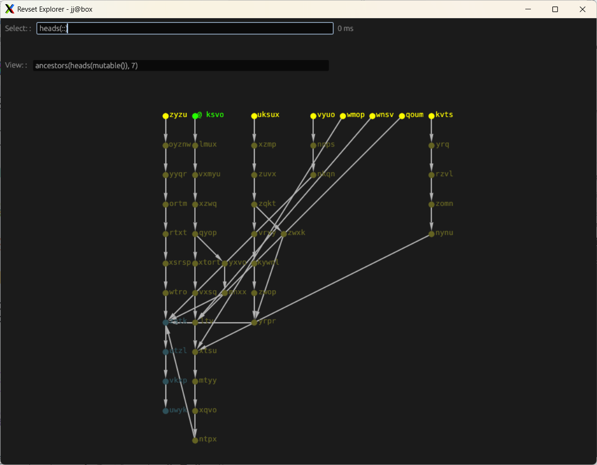

Revset Explorer is a tool to explore and better understand how [revsets](https://docs.jj-vcs.dev/latest/revsets/) work in Jujutsu (jj).

This software is an experiment and I don't expect to maintain it. However, I might accept ready-to-use PRs. 

# Installation 

```
cargo install --git=https://github.com/thomasa88/revset-explorer.git --locked
```

# Usage

Revset Explorer uses an existing JJ repository as basis for the graph. Navigate to a directory containing a JJ repository and run `revset-explorer` or use the flag `-R <path/to/repo>`.

The window that opens shows a part of the commit tree, as decided by the "view" input. The arrows point from child to parent commits.



Now you can enter your desired [revset](https://docs.jj-vcs.dev/latest/revsets/) in the "select" input. Nodes matching your filter will be highlighted. The time taken to resolve the revset is shown next to the text box. The value is averaged if the calculation time is not greater than 100 ms.

Use the "view" input to change what nodes are shown in the program.

Node colors:

* Green: Working copy (@)
* Turquoise: Immutable changes/commits
* Yellow: Changes/commits

# Sample graph

Revset Explorer can generate a sample repository with some common commit relations. To use it, you must first generate the sample repository and then ask Revset Explorer to use it.

```
revset-explorer --create-sample
revset-explorer -R revset-sample
```

# Things to improve

* Arrows: The arrows right now point towards parent commits. This is how data is stored in a repository, but many persons find it more intuitive when arrows pointing to the children. Using Undirevred for the graph was tested, but the nodes got more randomly placed than with the Directed edges. An alternative could be a checkbox to flip the direction when creating the edges. 

* Graphs of larger commit sets do not order nicely from bottom to top.

* The egui_graphs library is quite limited in what annotations and markings can be put in the graph, if one does not create custom shape implementations.
Edited28m

* Look-up of user revset aliases only checks one path.

* Better sample repository

* Make sample repository creation cross-platform

* Build the sample repository into the application.

* Do revset calculation time iterations in a separate task or thread.
